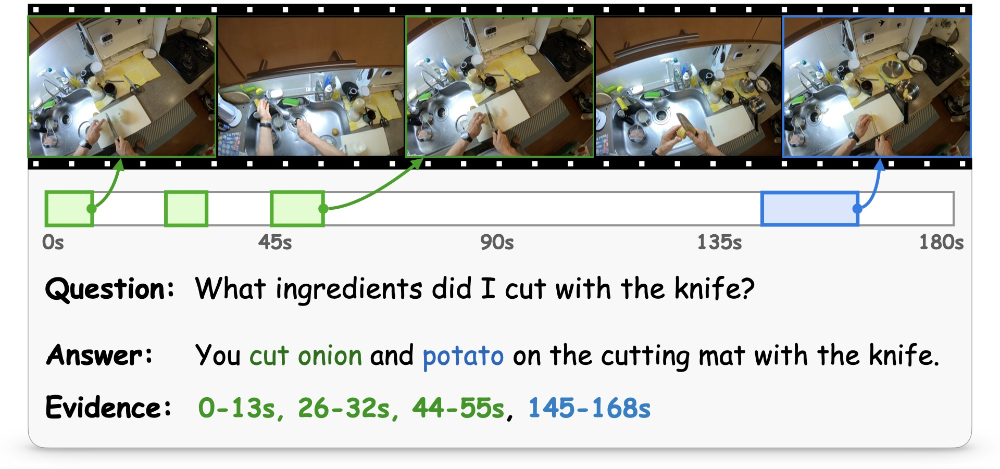
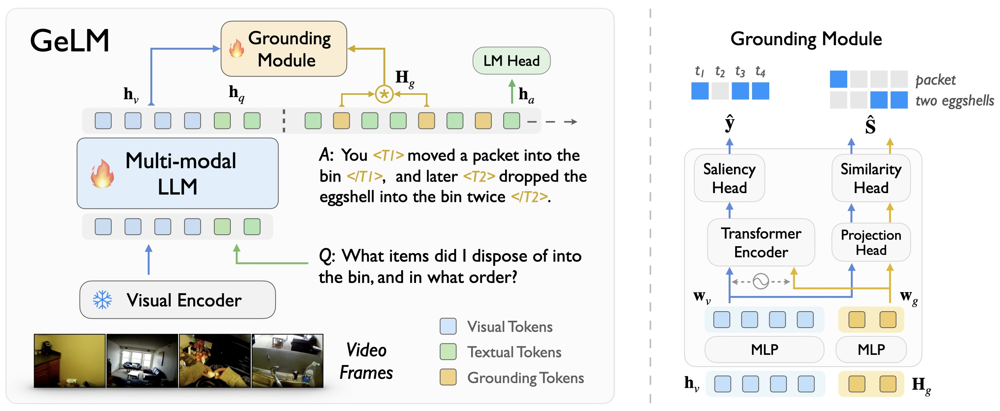

# Grounded Multi-Hop VideoQA in Long-Form Egocentric Videos

[🏡 Project Page](qirui-chen.github.io/MultiHop-EgoQA) |  [📄 Paper]() | [🤗 Dataset](https://huggingface.co/datasets/SurplusDeficit/MultiHop-EgoQA)


## Abstract

### Problem Scenario
This paper considers the problem of <em>Multi-Hop Video Question Answering (<u>MH-VidQA</u>)</em> in long-form egocentric videos. This task not only requires to answer visual questions, but also to localize multiple relevant time intervals within the video as visual evidences.

<div align="center">
   
</div>

### Baseline Method

We develop an automated pipeline to mine multi-hop question-answering pairs with associated temporal evidence, enabling to construct a large-scale dataset for instruction-tuning. We then propose a novel architecture, termed as <b><u>GeLM</u></b>, to leverage the world knowledge reasoning capabilities of multi-modal large language models (LLMs), while incorporating a grounding module to retrieve temporal evidence in the video with flexible grounding tokens.

<div align="center">
   
</div>


## 📂 Directory Structure

```bash
MultiHop-EgoQA/            
├── baseline/                       # Our Baseline Method
│   ├── checkpoints/                # Checkpoints of LLMs
│   │   ├──vicuna-v1-3-7b/
│   ├── datasets/                   # Save path of datasets
│   │   ├── multihop_qa/        
│   │   │   ├── features/     
│   │   │   ├── train_annotations.json
│   │   ├── activitynet-captions/     
│   │   │   ├── intern_feature/
│   │   │   ├── val_1.json
│   │   ├── temporal_reasoning/     
│   ├── gelm/                       # Implementation of the GeLM model
│   ├── llava/                      # LLaVa code base
│   ├── scripts/                    # Scripts for evaluating the baseline method
│   │   ├── eval_multihop_qa.sh     # Evaluate GeLM on MultiHop-EgoQA
│   │   └── eval_rtl.sh             # Evaluate GeLM on ActivityNet-RTL
│   └── pyproject.toml              # Configuration file
|
├── benchmark/                      # Benchmarking tools and metrics
│   ├── metrics/                    # Metrics calculation
│   └── zero-shot-inference/        # Zero-shot inference codes
```


## Datasets
See [Dataset Preparation](baseline/datasets/DATASET.md).


## Baseline Method

> Training setup: Ubuntu 18.04, CUDA 12.1, 4x Nvidia H800 (80GB)


### Training

1. Installing the environment.

```bash
cd baseline

conda create -n gelm python=3.10 -y
conda activate gelm

pip install --upgrade pip  # enable PEP 660 support
pip install -e .

pip install ninja
pip install flash-attn --no-build-isolation
```

2. Downloading LLM checkpoints and saving under `checkpoints`.
```bash
git clone https://huggingface.co/lmsys/vicuna-13b-v1.3
```


3. Training.
```bash
# Training on MultiHop-EgoQA
bash scripts/finetune_multihop_qa.sh

# Training on ActivityNet-RTL
bash scripts/finetune_rtl.sh

# Training on both MultiHop-EgoQA and ActivityNet-RTL
bash scripts/finetune_mixed.sh
```


### Checkpoints

We provide the checkpoints of GeLM-7B trained on MultiHop-EgoQA and ActivityNet-RTL on [Hugging face](), respectively.


### Evaluation

1. Evaluation on MultiHop-EgoQA

```bash
cd benchmark/metrics
bash evaluate.sh
```

2. Evaluation on ActivityNet-RTL

```bash
cd baseline
bash eval_rtl.sh
```


## 🫡 Acknowledgements

- Our baseline method implementation is adapted from the [LITA](https://github.com/NVlabs/LITA).

- The implementation of the zero-shot evaluation code references the official repositories of [TimeChat](https://github.com/RenShuhuai-Andy/TimeChat) and [VTimeLLM](https://github.com/huangb23/VTimeLLM), as well as the Hugging Face documentation of [InternVL2](https://huggingface.co/OpenGVLab/InternVL2-8B), [LLaVa-NeXT-Video](https://huggingface.co/lmms-lab/LLaVA-NeXT-Video-7B), [LLaVa-v1.6](https://huggingface.co/llava-hf/llava-v1.6-mistral-7b-hf), [Meta-Llama-3.1](https://huggingface.co/meta-llama/Meta-Llama-3-8B-Instruct), and the documentation of OpenAI [GPT-4o](https://github.com/openai/openai-cookbook/blob/main/examples/GPT_with_vision_for_video_understanding.ipynb) for video understanding.